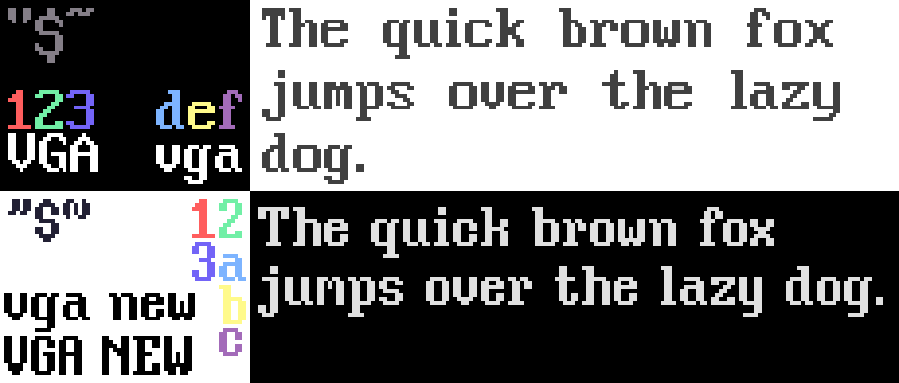

# "VGA" and "VGA New" Fonts

This duo of fonts are based off the font used by [VGA text mode](https://en.wikipedia.org/wiki/VGA_text_mode)
with the latter, "VGA New," being an opinionated improvement to fix flaws, such as poor alignment and low-quality letters.

## Modifications

You may further modify the fonts via using the [PixelForge](https://sergilazaro.itch.io/pixelforge) project files under `src`.

## License

The "VGA" font does *not* belong to me, so I cannot make any guarantees about its licensing, if it is licensed at all.
In regards to "VGA New," it belongs to me and is licensed under [CC 4.0 Attribution International](https://creativecommons.org/licenses/by/4.0/).

*If you use the font for anything cool, feel free to let me know via the issue tracker!*
